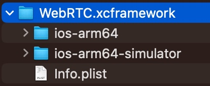

# Build of Webrtc for IOS

casue webrtc.xcfrmaework install by pod only compile in x64, we can not run simulator in m1/m2 mac.
and we did not want run xcode in Rosetta mode. so build it ourself.

> simulator and arm64 for m1 mac (including m1 pro,m1 max,m2... all Mac computers with Apple silicon)



#### step 1: get tools
```bash
git clone https://chromium.googlesource.com/chromium/tools/depot_tools.git
export PATH=`pwd`/depot_tools:"$PATH"
```

#### step 2: get source of Webrtc
```bash
mkdir -p build-webrtc
cd build-webrtc
fetch --nohooks webrtc_ios  #this will take a long time
gclient sync
```

#### step 3: build
```bash
# for true device
./src/tools_webrtc/ios/build_ios_libs.sh --build_config release --arch arm64 -o ./src/out_ios_libs_arm64

# for simulator
./src/tools_webrtc/ios/build_ios_libs.sh --build_config release --arch simulator:arm64 -o ./src/out_ios_libs_sim_arm64

# merge
xcodebuild -create-xcframework -framework ./src/out_ios_libs_arm64/WebRTC.xcframework/ios-arm64/WebRTC.framework \
  -framework ./src/out_ios_libs_sim_arm64/WebRTC.xcframework/ios-arm64-simulator/WebRTC.framework \
  -output src/WebRTC.xcframework
```

#### step 4: use
drag src/WebRTC.xcframework to xcode and start build

## thanks
https://github.com/pnoyelle/WebRTC_IOS
